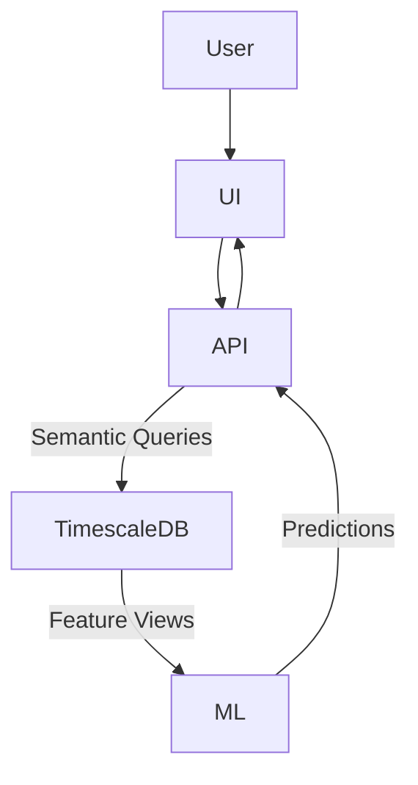

# 📊 Expense Trackers AI  
### Personal Finance Intelligence Engine

> A predictive, behavior-aware personal finance engine built on time-series intelligence — not a CRUD tracker.

---

## 0️⃣ Why This Exists

Most finance apps **observe** money.  
Expense Tracker AI **models, predicts, and intervenes** on money behavior.

| CRUD Tracker | Expense Tracker AI |
|-------------|-------------------|
| Logs expenses | Models financial dynamics |
| Displays charts | Produces financial intelligence |
| Static history | Predictive time-series reasoning |
| No agency | Active behavioral control |

---

## 1️⃣ System Contract
```
Database = Feature Store
Backend = Semantic Intelligence API
ML Layer = Forecasting & Anomaly Reasoning
UI = Pure Visualization


No business logic is allowed in UI.  
No ML logic is allowed in backend.  
No features are allowed outside SQL views.
```
---

## 2️⃣ Architecture



## 3️⃣ Technology Stack

| Layer          | Technology               |
| -------------- | ------------------------ |
| Time-Series DB | PostgreSQL + TimescaleDB |
| Feature Store  | SQL Semantic Views       |
| API            | FastAPI                  |
| ML             | Prophet, IsolationForest |
| Scheduler      | Airflow                  |
| Infra          | Docker                   |
| UI             | Next.js                  |

## 4️⃣ Repository Layout
```expense_tracker_ai/
│
├── docker-compose.yml
├── migrations/
│   ├── 001_init_schema.sql
│   ├── 002_views.sql
│   └── 003_feature_views.sql
│
├── backend/
│   ├── Dockerfile
│   ├── main.py
│   ├── db.py
│   ├── insights.py
│   └── schemas.py
│
└── ui/
```

## 5️⃣ SQL Feature Store
View	Financial Meaning
spend_7d	Short-term burn
spend_30d	Monthly lifestyle
spend_90d	Structural lifestyle
cash_velocity	Burn rate
subscriptions_detect	Recurring leakage

All views are model features, not reports.

## 6️⃣ Intelligence Endpoints
Endpoint	Purpose
/insights/spend?user_id=	Multi-horizon burn modeling
/insights/runway?user_id=	Cash runway estimation
/insights/subscriptions	Subscription leakage
/insights/risk (soon)	Payday survival

## 7️⃣ ML Layer
Model	Function
Prophet	Spend & runway forecasting
IsolationForest	Anomaly & leakage detection

## 8️⃣ Roadmap
Phase	Capability
Phase 1	Semantic finance engine
Phase 2	Forecasting + anomaly detection
Phase 3	Behavioral nudging
Phase 4	FIRE simulator

## 9️⃣ First Run
git clone
cd expense_tracker_ai
docker-compose up --build


API Docs:

http://localhost:8000/docs

🔬 Research Principle

Systems that only record money die.
Systems that predict & change behavior compound.

